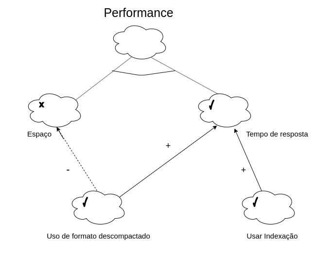

***

# NFR Framework

## Performance
- Espaço
    - Datacenters
- Tempo de resposta
    - Taxa de transferência
- Usar formato descompactado
- Usar indexação

## Modelagem

## Versionamento de edições desta página
| Data | Autor | Descrição | Versão |
|------|-------|-----------|--------|
| 21/10/2019 | Bruno Duarte | Base da Página | 0.1 |
| 21/10/2019 | Eugênio Sales | Base da Página | 0.2 |