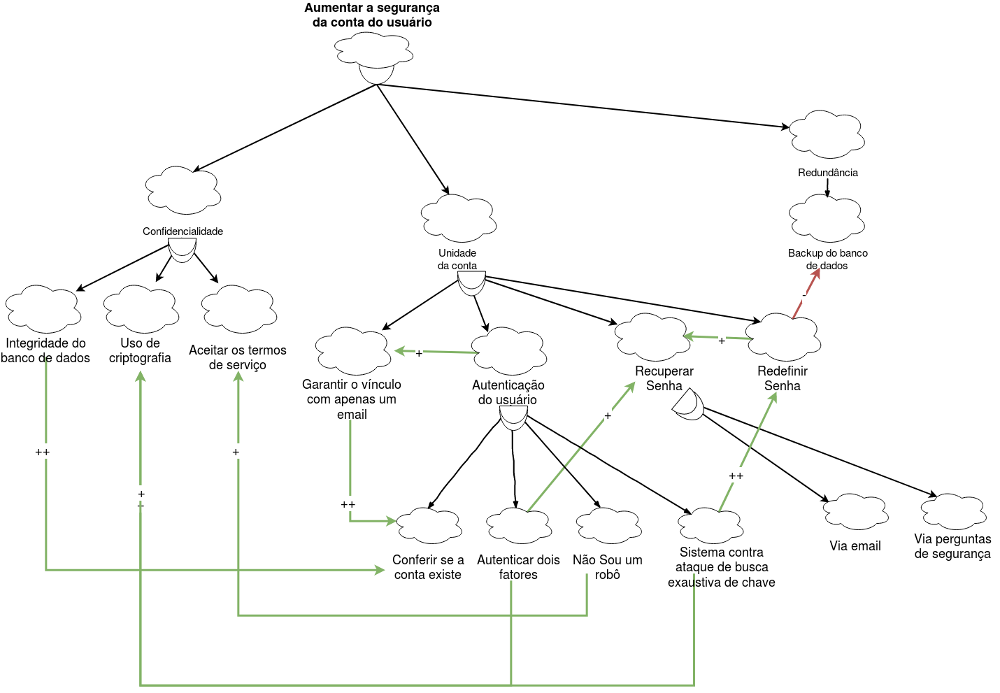

***

# NFR Framework

## Segurança
- Confidencialidade
    - Criptografia
    - Integridade do banco de dados
    - Termo de serviço

- Unidade da conta - Somente quem tem a senha consegue acessar a conta
    - Garantir o vínculo com apenas um email
    - Autenticação
        - Conferir se a conta existe
            - O nome de usuário e a senha fornecidos não correspondem às informações em nossos registros. Verifique-as e tente novamente.
        - Autenticação de dois fatores
            - Email
            - SMS
            - Google Authentication
        - Não sou um robô
        - Sistema contra ataque de busca exaustiva de chave
    - Recuperação de senha
        - Via email
        - Via pergunta de segurança
    - Redefinir senha
- Redundância
    - Backup do banco de dados

## Modelagem

***
## Versionamento de edições desta página
| Data | Autor | Descrição | Versão |
|------|-------|-----------|--------|
| 20/10/2019 | Fernando Aguilar | Criação da página | 0.1 |
