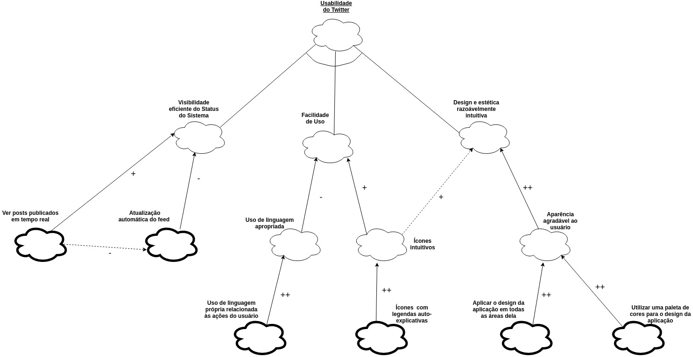

***

# NFR Framework

***

## Usabilidade
- **Visabilidade eficiente do Status do Sistema:**
    - Ver posts publicados em tempo real;
    - Atualização automática do feed.
- **Facilidade de Uso:**
    - Uso de linguagem apropriada:
        - Uso de linguagem própria relacionada às ações do usuário.
    - Ícones intuitivos:
        - Ícones com legendas auto-explicativas.
- **Design e estética razoávelmente intuitiva:**
    - Aparência agradável ao usuário:
        - Aplicar o design da aplicação em todas as áreas delas;
        - Utilizar uma paleta de cores para o design da aplicação.

***

## Modelagem

***

## Versionamento de edições desta página
| Data | Autor | Descrição | Versão |
|------|-------|-----------|--------|
| 21/10/2019 | Aline Laureano e Lorrany Azevedo | Criação da página, dos textos descritivos dela e adição do diagrama NFR. | 0.1 |
