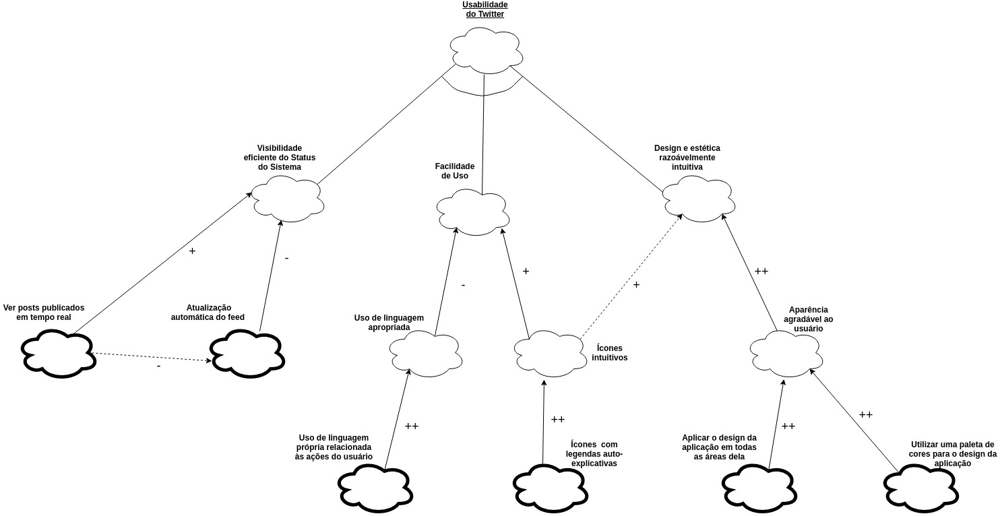
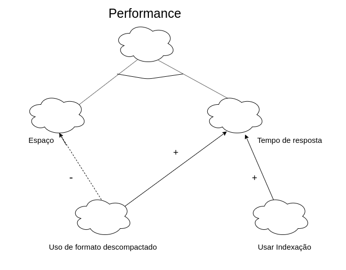

 
 

***

# NFR Framework

Diagramas desenvolvidos:

  - <a href="#nfr_geral1.0">**NFR do Twitter;**</a>
  - <a href="#nfr-seguranca">**Diagrama de Segurança;**</a>
  - <a href="#diagrama-usabilidade">**Diagrama de Usabilidade;**</a>
  - <a href="#performance">**Diagrama de Desempenho ou de Performance;**</a>

***

## **NFR do Twitter**
**Autor(es): Todo o grupo**

> - Junção dos diagramas de segurança, de usabilidade e de desempenho

### Versão 1.0

Clique na imagem para vê-la separadamente.

***
### Versão 0.1

Clique na imagem para vê-la separadamente.

***

## **Diagrama de Segurança**
**Autor(es): Erick e Fernando**
> - **Confidencialidade:**
>     - Criptografia;
>     - Integridade do banco de dados;
>     - Termo de serviço.
> - **Unidade da conta** - Somente quem tem a senha consegue acessar a conta:
>     - Garantir o vínculo com apenas um email;
>     - Autenticação:
>         - Conferir se a conta existe:
>             - O nome de usuário e a senha fornecidos não correspondem às informações em nossos registros. Verifique-as e tente novamente.
>         - Autenticação de dois fatores:
>             - Email;
>             - SMS;
>             - Google Authentication.
>         - Não sou um robô;
>         - Sistema contra ataque de busca exaustiva de chave.
>     - Recuperação de senha:
>         - Via email;
>         - Via pergunta de segurança.
>     - Redefinir senha;
> - **Redundância:**
>     - Backup do banco de dados.

### Versão 1.0

Clique na imagem para vê-la separadamente.

***
### Versão 0.1

Clique na imagem para vê-la separadamente.

***

## **Diagrama de Usabilidade**
**Autor(es): Aline e Lorrany**
> - **Visabilidade eficiente do Status do Sistema:**
>     - Ver posts publicados em tempo real;
>     - Atualização automática do feed.
> - **Facilidade de Uso:**
>     - Uso de linguagem apropriada:
>         - Uso de linguagem própria relacionada às ações do usuário.
>     - Ícones intuitivos:
        - Ícones com legendas auto-explicativas.
> - **Design e estética razoávelmente intuitiva:**
>     - Aparência agradável ao usuário:
>         - Aplicar o design da aplicação em todas as áreas delas;
>         - Utilizar uma paleta de cores para o design da aplicação.

### Versão 1.0

Clique na imagem para vê-la separadamente.

***
### Versão 0.1

Clique na imagem para vê-la separadamente.

***

## **Diagrama de Desempenho ou de Performance**
**Autor(es): Bruno e Eugênio**
> - **Espaço:**
>     - Datacenters.
> - **Tempo de resposta:**
>     - Taxa de transferência.
>         - Usar formato descompactado;
>         - Usar indexação.

### Versão 1.0

<san id="performance">

Clique na imagem para vê-la separadamente.
***
### Versão 0.1

Clique na imagem para vê-la separadamente.

---
##Referências
---
- **[Moodle]** Serrano, Maurício. Serrano, Milene. Aula 17: Modelagem de Requisitos - GORE.

***

## Versionamento de edições desta página
---
| Data | Autor | Descrição | Versão |
|------|-------|-----------|--------|
| 20/10/2019 | Fernando Aguilar | Criação da página e ajuste para a adição do diagrama de segurança. | 0.1 |
| 21/10/2019 | Bruno Duarte | Ajuste da página para a adição do diagrama de performance. | 0.2 |
| 21/10/2019 | Eugênio Sales | Ajuste da página para a adição do diagrama de performance. | 0.3 |
| 21/10/2019 | Aline Laureano e Lorrany Azevedo | Ajuste da página para a adição do diagrama de usabilidade. | 0.4 |
| 21/10/2019 | Lorrany Azevedo | Ajuste da página para a adição do diagrama Geral. | 0.5 |
| 22/10/2019 | Aline Laureano | Padronização do layout da página e adição dos links internos para os diagramas. | 0.6 |
| 22/10/2019 | Erick Giffoni | Adição dos autores de cada diagrama | 0.6.1 |
| 24/11/2019 | Erick Giffoni | Adição dos diagramas e do NFR refatorados Formatação da página | 1.0 |
| 25/11/2019 | Aline Laureano | Formatação no layout da página e adição da referência. | 1.1 |
