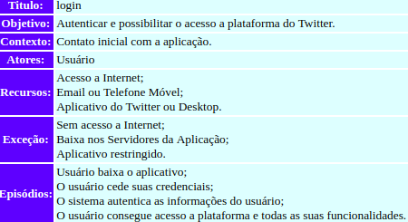
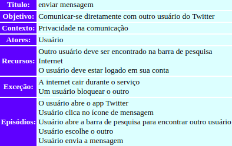
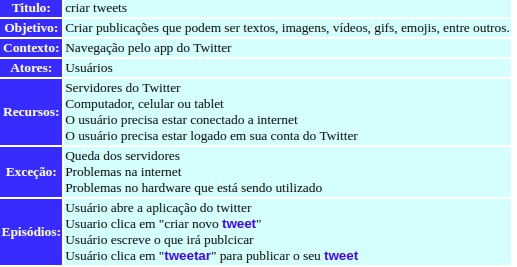
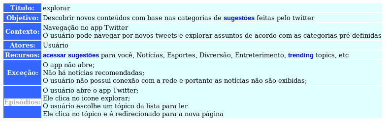

***
# Sobre a Modelagem de requisitos de software
Trata-se da atividade de elaborar modelos capazes de representar características ou comportamentos de um software. Essa abordagem representa aspectos muito abstratos de maneira mais concreta e simplifica aspectos muito técnicos.
***
# Sobre os Cenários
Um cenário é uma estratégia reconhecida para compreender as interações entre ambiente e sistema, bem como elicitar a parte comportamental do software, sua dinâmica e/ou seu fluxo.

Nossa equipe optou por utilizar a ferramenta C&L, disponível [aqui](http://pes.inf.puc-rio.br/cel/aplicacao/), para projetar cenários para o Twitter.
***
# Alguns cenários para o app Twitter
## Trending Topics

**Autor** : Erick Giffoni  
**Versão:** 0.1

## Login

**Autor** : Bruno Duarte  
**Versão:** 0.1

## Enviar Mensagem

**Autor** : Eugênio Sales  
**Versão:** 0.1

## Criar Tweets

**Autor** : Lorrany Azevedo  
**Versão:** 0.1

## Explorar

**Autor** : Fernando Aguilar  
**Versão:** 0.1

***

***
## Versionamento de edições desta página
| Data | Autor | Descrição | Versão |
|------|-------|-----------|--------|
| 27/09/2019 | Erick Giffoni | Criação da página | 0.1 |
| 27/09/2019 | Bruno Duarte | Adição de cenário: Login | 0.1 |
| 27/09/2019 | Bruno Duarte | Adição de cenário: Enviar Mensagem | 0.1 |
| 30/09/2019 | Lorrany Azevedo | Adição de cenário: Criar Tweets | 0.1 |
| 30/09/2019 | Fernando Aguilar | Adição de cenário: Explorar | 0.1 |

