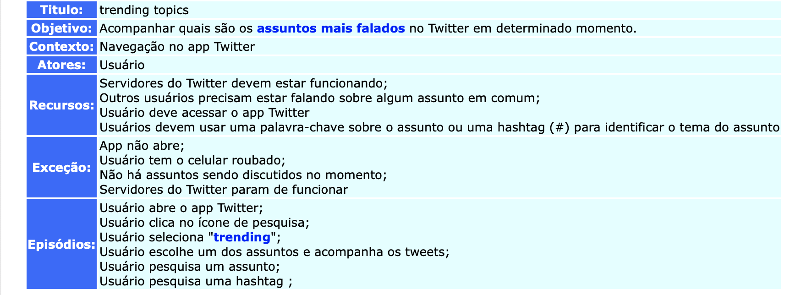

 
 

***
# Sobre a Modelagem de requisitos de software
Trata-se da atividade de elaborar modelos capazes de representar características ou comportamentos de um software. Essa abordagem representa aspectos muito abstratos de maneira mais concreta e simplifica aspectos muito técnicos.
***
#Cenários
Um cenário é uma estratégia reconhecida para compreender as interações entre ambiente e sistema, bem como elicitar a parte comportamental do software, sua dinâmica e/ou seu fluxo.

Nossa equipe optou por utilizar a ferramenta C&L, disponível [aqui](http://pes.inf.puc-rio.br/cel/aplicacao/), para projetar cenários para o Twitter.
***
## Alguns cenários para o app Twitter
***
### Trending Topics
**Autor** : Erick Giffoni  
**Versão:** 0.1   

### Login
**Autor** : Bruno Duarte  
**Versão:** 0.1   

### Enviar Mensagem
**Autor** : Eugênio Sales  
**Versão:** 0.1   

### Criar Tweets
**Autor** : Lorrany Azevedo  
**Versão:** 0.1   

### Explorar
**Autor** : Fernando Aguilar  
**Versão:** 0.1   

### Comentar Tweets
**Autor** : Aline Laureano  
**Versão:** 0.1   

---
##Referências
---
- **[Moodle]** Serrano, Maurício. Serrano, Milene. Aula 10: Cenários e Léxicos.

***
## Versionamento de edições desta página
---

| Data | Autor | Descrição | Versão |
|------|-------|-----------|--------|
| 27/09/2019 | Erick Giffoni | Criação da página | 0.1 |
| 27/09/2019 | Bruno Duarte | Adição de cenário: Login | 0.2 |
| 27/09/2019 | Bruno Duarte | Adição de cenário: Enviar Mensagem | 0.3 |
| 30/09/2019 | Lorrany Azevedo | Adição de cenário: Criar Tweets | 0.4 |
| 30/09/2019 | Fernando Aguilar | Adição de cenário: Explorar | 0.5 |
| 30/09/2019 | Aline Laureano | Adição de cenário: Comentar Tweets | 0.6 |
| 11/10/2019 | Aline Laureano | Formatação do layout da página. | 0.7 |
| 25/11/2019 | Aline Laureano | Formatação no layout da página e adição da referência. | 0.8 |
