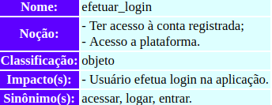
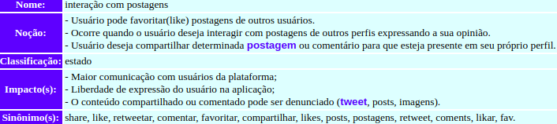
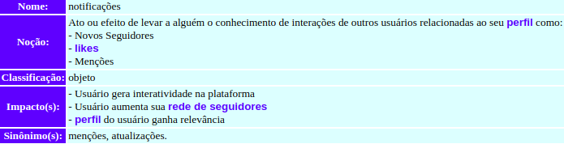
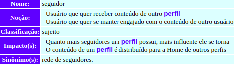
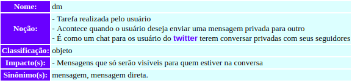
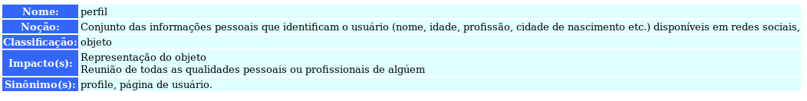
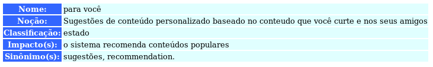
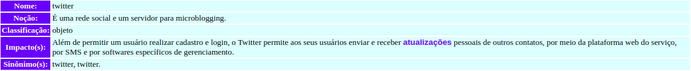
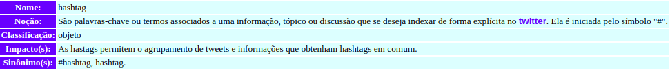

***
# Sobre os Léxicos
**LAL - Léxico Ampliado da Linguagem**

Trata-se de uma técnica que compõe os [cenários](../cenarios/cenarios.md) de forma a descrever os símbolos de uma linguagem.   Nesse caso, essa técnica descreve alguns termos relacionados ao software em questão.

Cada símbolo tem um nome, uma noção e um impacto, sendo que :  

- noção : é o que significa o símbolo (denotação);  
- impacto : é o efeito do símbolo na aplicação ou o efeito de algo na aplicação sobre o símbolo (conotação).

Símbolos também possuem uma classificação, que pode ser : estado ; verbo ; objeto ; sujeito.
***
# Alguns léxicos para o app Twitter

## Trending

**Autor** : Erick Giffoni  
**Versão:** 0.1  

## Tweet
**Autor** : Erick Giffoni  
**Versão:** 0.1  

## Efetuar login
**Autor** : Bruno Duarte  
**Versão:** 0.1  

## Interações com Postagens
**Autor** : Bruno Duarte  
**Versão:** 0.1  

## Notificações
**Autor** : Eugênio Sales  
**Versão:** 0.1  

 |

## Seguidor
**Autor** : Eugênio Sales  
**Versão:** 0.1  

## Direct Message
**Autor** : Lorrany Azevedo  
**Versão:** 0.1  

## Tweetar
**Autor** : Lorrany Azevedo  
**Versão:** 0.1  

## Perfil
**Autor** : Fernando Aguilar  
**Versão:** 0.1  

## Para Voce
**Autor** : Fernando Aguilar  
**Versão:** 0.1  

## Twitter
**Autor** : Aline Laureano  
**Versão:** 0.1  

## Hashtag
**Autor** : Aline Laureano  
**Versão:** 0.1  

***
## Versionamento de edições desta página
| Data | Autor | Descrição | Versão |
|------|-------|-----------|--------|
| 27/09/2019 | Erick Giffoni | Criação da página | 0.1 |
| 27/09/2019 | Bruno Duarte | Adição de lexicos: Login e Interações de usuário com postagem | 0.2 |
| 27/09/2019 | Eugênio Sales | Adição de Léxicos: Notificações e Seguidor | 0.3 |
| 30/09/2019 | Erick Giffoni | Edição do texto sobre léxicos e correção do título Efetuar login| 0.4 |
| 30/09/2019 | Lorrany Azevedo | Adição de léxicos: Tweetar e DM| 0.5 |
| 30/09/2019 | Fernando Aguilar | Adição de léxicos: Perfil e Para Voce| 0.6 |
| 30/09/2019 | Aline Laureano | Adição de léxicos: Hashtag & Twitter | 0.7 |
