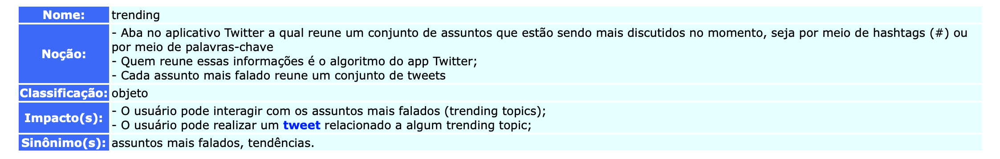
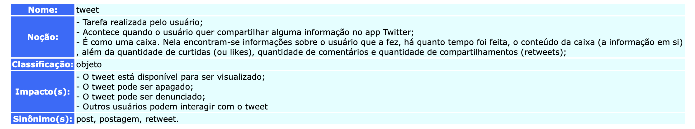

***
# Sobre os Léxicos
**LAL - Léxico Ampliado da Linguagem**

Trata-se de uma técnica que compõe os [cenários](../cenarios/cenarios.md) de forma a descrever os símbolos de uma linguagem.   Nesse caso, essa técnica descreve alguns termos relacionados ao software em questão.

Cada símbolo tem um nome, uma noção e um impacto, sendo que :
- noção : é o que significa o símbolo (denotação);
- impacto : é o efeito do símbolo na aplicação ou o efeito de algo na aplicação sobre o símbolo (conotação).

Símbolos também possuem uma classificação, que pode ser : estado ; verbo ; objeto ; sujeito.
***
# Alguns léxicos para o app Twitter
## Trending

**Autor** : Erick Giffoni  
**Versão:** 0.1

## Tweet

**Autor** : Erick Giffoni  
**Versão:** 0.1
***
## Versionamento de edições desta página
| Data | Autor | Descrição | Versão |
|------|-------|-----------|--------|
| 27/09/2019 | Erick Giffoni | Criação da página | 0.1 |
