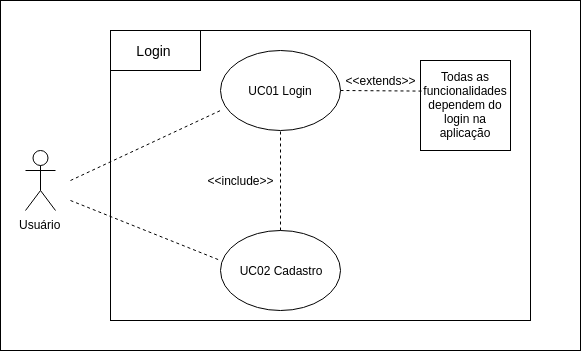

***
# Caso de Uso - Efetuar Login

## Especificações

UC01 - Efetuar Login

|  |  |
|------|-------|
| **Descrição** | Autenticar o acesso do usuário a rede social, tendo acesso a todo conteúdo relacionado a suas especificações e interações. |
| **Ator(es)** | Usuário |
| **Pré-Condições** | * Possuir cadastro/conta no Twitter   * Acesso a Internet   * Aplicativo mobile ou desktop
 |
| **Pós-Condições** | Acesso a homepage e funcionalidades existentes no sistema |
| **Fluxo Princtipal** |[FP01] Este fluxo é necessário para o usuário utilizar/acessar o sistema 1. O ator abre o aplicativo do twitter   2. O sistema fornece a página de login   3.  O ator fornece os campos de username e senha  4. O ator clica em "Entrar"   5. O sistema autentica o usuário e seus dados|
| **Fluxo(s) Alternativos** | [FA01] Este fluxo relata o primeiro contato do usuário com a plataforma 1. O ator abre o aplicativo do twitter   2. O sistema fornece a página de login e sing up   3. O sistema fornece parte de cadastro(sing up)   4. O ator cadastra seus dados   5. O sistema busca identificar e confirmar a identidade do futuro usuário 6. O sistema autentica o usuário e seus dados |
| **Fluxo(s) de exceção** | [FE01-A] O fluxo a seguir exprime uma adversidade do usuário no sistema  1. O ator abre o aplicativo do twitter   2. O sistema fornece a página de login  3. O ator não se recorda de suas credenciais de acesso 4. O sistema oferece suporte de recuperação de credenciais   5. O sistema fornece refatoração dos daos  6. O sistema autentica o usuário e seus dados   [FE01-B] O usuário não possui acesso a Internet|
||
**Autores:** Bruno, Eugênio  
**Versão:** 0.1
***

## Versionamento de edições desta página
| Data | Autor | Descrição | Versão |
|------|-------|-----------|--------|
| 27/09/2019 | Bruno Henrique | Adição descrição e atores| 0.1 |
| 27/09/2019 | Eugênio Sales | Adição de fluxos alternativos e excessão | 0.2 |
| 27/09/2019 | Erick Giffoni | Melhorias na edição da página | 0.2.1 |
| 30/09/2019 | Bruno | Refatorando a página | 0.2.2 |
