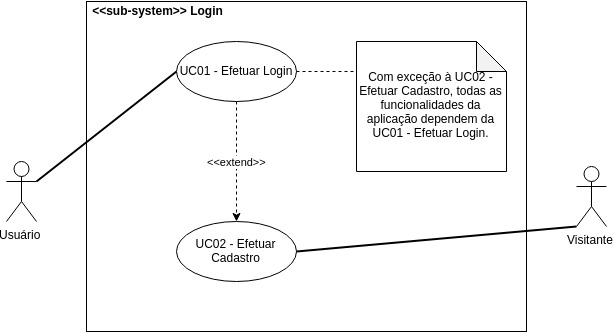

***
# Caso de Uso: Efetuar Login

***
##Diagrama

***
**Autore(s):** Bruno Henrique, Eugênio Sales e Aline Laureano.  
**Versão:** *0.2 (última versão)*

***
**Autores:** Bruno Henrique e Eugênio Sales. 
**Versão:** *0.1*

***
##Especificações
***

### <a href="#">UC01</a> - Efetuar Login
**Autores:** Bruno Henrique e Eugênio Sales. 
**Versão:** *0.1*

|  |  |
|------|-------|
| **Descrição** | Autenticar o acesso do usuário a rede social, tendo acesso a todo conteúdo relacionado a suas especificações e interações. |
| **Ator(es)** | Usuário |
| **Pré-Condições** | * Possuir cadastro/conta no Twitter   * Acesso a Internet   * Aplicativo mobile ou desktop|
| **Pós-Condições** | Acesso a homepage e funcionalidades existentes no sistema |
| **Fluxo Princtipal** |[FP01] Este fluxo é necessário para o usuário utilizar/acessar o sistema 1. O ator abre o aplicativo do twitter   2. O sistema fornece a página de login   3.  O ator fornece os campos de username e senha  4. O ator clica em "Entrar"   5. O sistema autentica o usuário e seus dados|
| **Fluxo(s) Alternativos** | [FA01] Este fluxo relata o primeiro contato do usuário com a plataforma 1. O ator abre o aplicativo do twitter   2. O sistema fornece a página de login e sing up   3. O sistema fornece parte de cadastro(sing up)   4. O ator cadastra seus dados   5. O sistema busca identificar e confirmar a identidade do futuro usuário 6. O sistema autentica o usuário e seus dados |
| **Fluxo(s) de exceção** | [FE01-A] O fluxo a seguir exprime uma adversidade do usuário no sistema  1. O ator abre o aplicativo do twitter   2. O sistema fornece a página de login  3. O ator não se recorda de suas credenciais de acesso 4. O sistema oferece suporte de recuperação de credenciais   5. O sistema fornece refatoração dos daos  6. O sistema autentica o usuário e seus dados   [FE01-B] O usuário não possui acesso a Internet|
||

### <a href="#">UC02</a> - Efetuar Cadastro

**Autore(s):** Aline Laureano.  
**Versão:** *0.1*

|  |  |
|------|-------|
| **Descrição** |Funcionalidade responsável por cadastrar novos usuários na aplicação. |
| **Ator(es)** | Visitante e Usuário. |
| **Pré-Condições** | O Visitante deve ter conexão com a internet. |
| **Pós-Condições** | O Visitante terá uma nova conta cadastrada no Twitter. O Visitante vai se tornar um novo Usuário da aplicação.|
| **Fluxo Principal** | [FP01] Fluxo iniciado quando um Visitante deseja se cadastrar no Twitter: 1. O Visitante clica em “Inscrever-se”; 2. O Visitante digita o seu nome e o seu número de celular; 3. O Visitante clica em “Avançar”; 4. O Visitante seleciona as opções para personalizar a experiência dele com o Twitter; 5. O Visitante clica em “Avançar” novamente; 6. O Visitante confirma os seus dados e clica em “Inscrever-se”; 7. O Visitante recebe um código de verificação no seu celular; 8. O Visitante digita o código de verificação na página de cadastro do Twitter; 9. O Visitante digita o seu nome de usuário do Twitter; 10. O Visitante é redirecionado como Usuário para uma a sua conta cadastrada no Twitter. |
| **Fluxo(s) Alternativos** | - |
| **Fluxo(s) de exceção** | [FE01] Falha de conexão com a internet: No passo 1 do [FP01] ocorre uma falha de conexão com a Internet. |

***

## Versionamento de edições desta página
| Data | Autor | Descrição | Versão |
|------|-------|-----------|--------|
| 27/09/2019 | Bruno Henrique | Adição descrição e atores| 0.1 |
| 27/09/2019 | Eugênio Sales | Adição de fluxos alternativos e excessão | 0.2 |
| 27/09/2019 | Erick Giffoni | Melhorias na edição da página | 0.2.1 |
| 30/09/2019 | Bruno Henrique | Refatorando a página | 0.2.2 |
| 25/11/2019 | Aline Laureano | Padronização do layout desta página com as demais páginas de Casos de Uso e adição da: - Versão 0.2 do diagrama; - Versão 0.1 da UC02.  | 0.3 |
