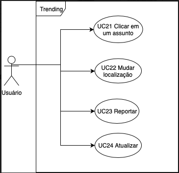

***
# Caso de Uso - Trending Topics

## Especificações

UC021 - Clicar em um Assunto 

|  |  |
|------|-------|
| **Descrição** | O usuário é capaz de abrir um tópico em destaque |
| **Ator(es)** | Usuário |
| **Pré-Condições** | * Deve haver tópicos   * O tópico deve estar entre os mais populares na localização |
| **Pós-Condições** | O sistema abrirá a página com [tweets]() relacionados ao tópico |
| **Fluxo Princtipal** | [FP21] Este fluxo se inicia quando o usuário escolhe um dos tópicos   1. Ele abre o aplicativo do twitter   2. Ele clica na aba buscar   3. Ele seleciona [trending]()   4. Ele clica no tópico  |
| **Fluxo(s) Alternativos** | * [FA21-A] O usuário não clica em nenhum tópico   * [FA21-B] O usuário [reporta]() o tópico  |
| **Fluxo(s) de exceção** | O sistema apresenta uma mensagem de erros e [atualiza]() a página |
||

***

UC022 - Mudar Localização

| | |
|------|-------|
| Descrição | |
| Ator(es) | |
| Pré-Condições |  |
| Pós-Condições |  |
| Fluxo Princtipal |  |
| Fluxo(s) Alternativos |  |
| Fluxo(s) de exceção |  |

UC023 - Reportar

| | |
|------|-------|
| Descrição | |
| Ator(es) | |
| Pré-Condições |  |
| Pós-Condições |  |
| Fluxo Princtipal |  |
| Fluxo(s) Alternativos |  |
| Fluxo(s) de exceção |  |

UC024 - Atualizar

| | |
|------|-------|
| Descrição | |
| Ator(es) | |
| Pré-Condições |  |
| Pós-Condições |  |
| Fluxo Princtipal |  |
| Fluxo(s) Alternativos |  |
| Fluxo(s) de exceção |  |

***
## Caso de uso: Trending Topics
**Autores:** Erick, Fernando  
**Versão:** 0.1
***

## Versionamento de edições desta página
| Data | Autor | Descrição | Versão |
|------|-------|-----------|--------|
| 26/09/2019 | Fernando Aguilar | Criação da página | 0.1 |
