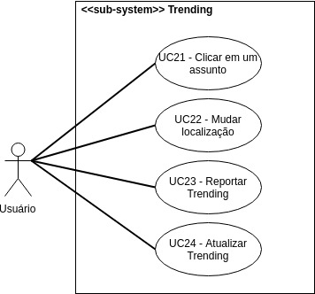
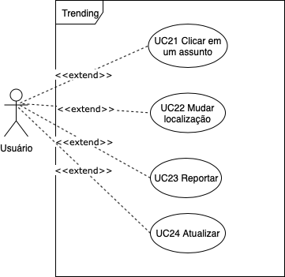

 
 

***
# Caso de Uso: Trending Topics

***
##Diagrama

***

**Autore(s):** Erick Giffoni, Fernando Aguilar e Aline Laureano.  
**Versão:** *0.2 (última versão)*

***
**Autores:** Erick Giffoni e Fernando Aguilar. 
**Versão:** *0.1*

***
##Especificações
***

### <a href="#">UC021</a> - Clicar em um Assunto
**Autores:** Erick Giffoni e Fernando Aguilar. 
**Versão:** *0.1*  

|  |  |
|------|-------|
| **Descrição** | O usuário é capaz de abrir um tópico em destaque |
| **Ator(es)** | Usuário |
| **Pré-Condições** | * Deve haver tópicos   * O tópico deve estar entre os mais populares na localização |
| **Pós-Condições** | O sistema abrirá a página com [tweets](https://requisitos-de-software.github.io/2019.2-Twitter/modelagem/lexicos/lexicos/#tweet) relacionados ao tópico |
| **Fluxo Principal** | [FP21] Este fluxo se inicia quando o usuário escolhe um dos tópicos   1. Ele abre o aplicativo do twitter   2. Ele clica na aba buscar   3. Ele seleciona [trending](https://requisitos-de-software.github.io/2019.2-Twitter/modelagem/lexicos/lexicos/#trending)   4. Ele clica no tópico  |
| **Fluxo(s) Alternativos** | * [FA21-A] O usuário não clica em nenhum tópico   * [FA21-B] O usuário [reporta](#uc23-reportar) o tópico  |
| **Fluxo(s) de exceção** | [FE21] O sistema apresenta uma mensagem de erros e [atualiza](#uc24-atualizar) a página |

### <a href="#">UC22</a> - Mudar Localização
**Autores:** Erick Giffoni e Fernando Aguilar. 
**Versão:** *0.1*  

| | |
|------|-------|
| Descrição | O usuário pode mudar a localização dele no aplicativo para conseguir visualizar [trending topics](https://requisitos-de-software.github.io/2019.2-Twitter/modelagem/use_cases_specifications/trending_topics/#caso-de-uso-trending-topics) relevantes  daquela região|
| Ator(es) | Usuário |
| Pré-Condições | * Sistema está funcionando |
| Pós-Condições | * O app volta para a tela anterior   * O usuário clica em "done" |
| Fluxo Principal | [FP22] Esse fluxo se inicia quando o usuário, a partir da tela "trending", clica no ícone de engrenagem no  canto superior direito e seleciona a opção de mudar localização. A partir daí ele escolhe o novo local e depois  conclui a tarefa clicando no ícone de concluído |
| Fluxo(s) Alternativos | * [FA22-A] O usuário seleciona o ícone da engrenagem, mas em seguida clica em voltar   * [FA22-B] O usuário seleciona a engrenagem, depois clica em mudar localização mas não muda efetivamente,  e volta para a aba anterior|
| Fluxo(s) de exceção | FE22] O sistema apresenta uma mensagem de erros e [atualiza](#uc24-atualizar) a página |

### <a href="#">UC23</a> - Reportar Trending

**Autores:** Erick Giffoni, Fernando Aguilar e Aline Laureano. 
**Versão:** *0.2 (última versão)*  

| | |
|------|-------|
| Descrição | O usuário pode reportar um [trend](https://requisitos-de-software.github.io/2019.2-Twitter/modelagem/lexicos/lexicos/#trending)(assunto) de forma a classificá-lo como spam, abusivo, réplica ,não relevante   ou baixa qualidade|
| Ator(es) | Usuário |
| Pré-Condições | * Existir um tweet   * Sistema deve estar no ar|
| Pós-Condições | * O tweet será investigado pelo Twitter   * Usuário continua a navegar   * Usuário pode bloquear o autor do tweet|
| Fluxo Principal | [FP23] Esse fluxo se inicia quando o usuário seleciona a opção de reportar um assunto, a partir da tela "trending",  então escolhe a categoria a qual quer reportar |
| Fluxo(s) Alternativos | [FA23] O usuário seleciona a opção de reportar mas, logo em seguida, volta à tela anterior|
| Fluxo(s) de exceção | [FE23] O sistema apresenta uma mensagem de erros e [atualiza](#uc24-atualizar) a página |

### <a href="#">UC23</a> - Reportar
**Autores:** Erick Giffoni e Fernando Aguilar. 
**Versão:** *0.1*  

| | |
|------|-------|
| Descrição | O usuário pode reportar um [trend](https://requisitos-de-software.github.io/2019.2-Twitter/modelagem/lexicos/lexicos/#trending)(assunto) de forma a classificá-lo como spam, abusivo, réplica ,não relevante   ou baixa qualidade|
| Ator(es) | Usuário |
| Pré-Condições | * Existir um tweet   * Sistema deve estar no ar|
| Pós-Condições | * O tweet será investigado pelo Twitter   * Usuário continua a navegar   * Usuário pode bloquear o autor do tweet|
| Fluxo Principal | [FP23] Esse fluxo se inicia quando o usuário seleciona a opção de reportar um assunto, a partir da tela "trending",  então escolhe a categoria a qual quer reportar |
| Fluxo(s) Alternativos | [FA23] O usuário seleciona a opção de reportar mas, logo em seguida, volta à tela anterior|
| Fluxo(s) de exceção | [FE23] O sistema apresenta uma mensagem de erros e [atualiza](#uc24-atualizar) a página |

### <a href="#">UC24</a> - Atualizar Trending
**Autores:** Erick Giffoni, Fernando Aguilar e Aline Laureano. 
**Versão:** *0.2 (última versão)*  

| | |
|------|-------|
| Descrição | O usuário pode deslizar a tela para baixo e, dessa forma, forçar a atualização da tela "trending" |
| Ator(es) | Usuário |
| Pré-Condições | * App está funcionando |
| Pós-Condições | * A tela está atualizada  * Usuário continua a navegação |
| Fluxo Principal | [FP24] O usuário desliza a tela para baixo e a tela é atualizada |
| Fluxo(s) Alternativos | [FA24] O usuário não atualiza a tela porque o sistema faz isso automaticamente |
| Fluxo(s) de exceção | [FE24] O sistema apresenta uma mensagem de erros e [atualiza](#uc24-atualizar) a página |

### <a href="#">UC24</a> - Atualizar
**Autores:** Erick Giffoni e Fernando Aguilar. 
**Versão:** *0.1*  

| | |
|------|-------|
| Descrição | O usuário pode deslizar a tela para baixo e, dessa forma, forçar a atualização da tela "trending" |
| Ator(es) | Usuário |
| Pré-Condições | * App está funcionando |
| Pós-Condições | * A tela está atualizada  * Usuário continua a navegação |
| Fluxo Principal | [FP24] O usuário desliza a tela para baixo e a tela é atualizada |
| Fluxo(s) Alternativos | [FA24] O usuário não atualiza a tela porque o sistema faz isso automaticamente |
| Fluxo(s) de exceção | [FE24] O sistema apresenta uma mensagem de erros e [atualiza](#uc24-atualizar) a página |

***

## Versionamento de edições desta página
| Data | Autor | Descrição | Versão |
|------|-------|-----------|--------|
| 26/09/2019 | Fernando Aguilar | Criação da página | 0.1 |
| 27/09/2019 | Erick Giffoni | - Melhorias na página   - Adição de mais especificações | 0.2 |
| 27/09/2019 | Erick Giffoni e Fernando Aguilar | Adição de mais especificações | 0.3 |
| 25/11/2019 | Aline Laureano | Padronização do layout desta página com as demais páginas de Casos de Uso e adição da: - Versão 0.2 do diagrama; - Versão 0.2 da UC23; - Versão 0.2 da UC24.  | 0.4 |
