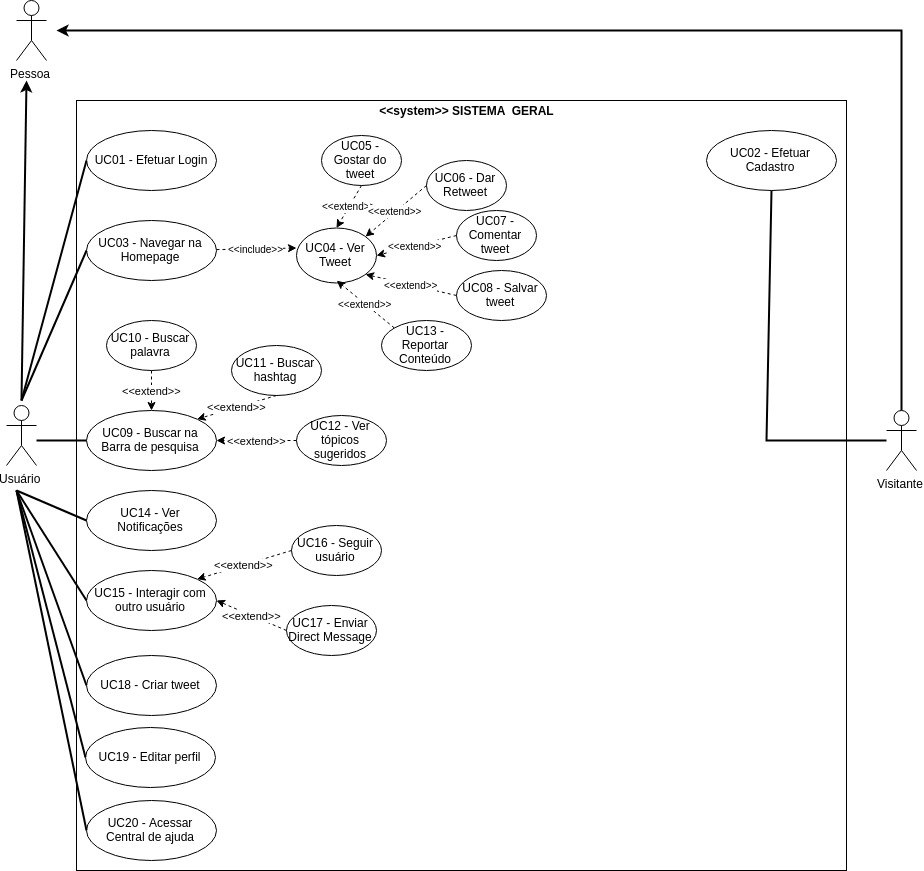

***
#Caso de Uso: Sistema Geral

***
##Diagrama

***
**Autore(s):** Lorrany Azevedo e Aline Laureano.  
**Versão:** *0.2 (última versão)*

***
**Autore(s):** Lorrany Azevedo e Aline Laureano.  
**Versão:** *0.1*

***
##Especificações
***

### <a href="#UC01">UC01</a> - Efetuar Login

**Autore(s):** Aline Laureano.  
**Versão:** 0.1

|  |  |
|------|-------|
| **Descrição** | É a funcionalidade que realiza o login no Twitter. |
| **Ator(es)** | Usuário. |
| **Pré-Condições** | O usuário deve estar cadastrado no Twitter. O usuário deve ter conexão com a Internet.|
| **Pós-Condições** | O usuário terá o seu login efetuado na aplicação. O usuário terá acesso a todas as funcionalidades em que ele tem permissão de uso na aplicação.|
| **Fluxo Principal** | [FP01] Fluxo iniciado quando o usuário deseja efetuar o login no Twitter: 1. O usuário clica em “Entrar”; 2. O usuário digita o seu e-mail; 3. O usuário digita a sua senha de acesso à sua conta; 4. O usuário é redirecionado para a página inicial da aplicação com o login já efetuado. |
| **Fluxo(s) Alternativos** |[FA01] No passo 3 do [FP01], caso o usuário esqueça a sua senha ele deve: 1. Clicar no link “Esqueceu sua senha?”; 2. Digitar o e-mail cadastrado na sua conta do Twitter; 3. Clicar em Buscar; 4. Escolher se o link de redefinição de senha será enviado para o seu celular ou para o seu e-mail; 5. Acessar o link de redefinição de senha; 6. Digitar a nova senha de acesso à sua conta no Twitter; 7. Digitar novamente a nova senha; 8. Clicar no botão “Confirmar”; 9. O usuário é redirecionado para a página inicial da aplicação com o login efetuado com a sua nova senha.|
| **Fluxo(s) de exceção** | [FE01] Falha de conexão com a internet: No passo 2 do [FP01] ocorre uma falha de conexão com a Internet. |

### <a href="#UC02">UC02</a> - Efetuar Cadastro

**Autore(s):** Aline Laureano.  
**Versão:** 0.1

|  |  |
|------|-------|
| **Descrição** |Funcionalidade responsável por cadastrar novos usuários na aplicação. |
| **Ator(es)** | Visitante e Usuário. |
| **Pré-Condições** | O Visitante deve ter conexão com a internet. |
| **Pós-Condições** | O Visitante terá uma nova conta cadastrada no Twitter. O Visitante vai se tornar um novo Usuário da aplicação.|
| **Fluxo Principal** | [FP01] Fluxo iniciado quando um Visitante deseja se cadastrar no Twitter: 1. O Visitante clica em “Inscrever-se”; 2. O Visitante digita o seu nome e o seu número de celular; 3. O Visitante clica em “Avançar”; 4. O Visitante seleciona as opções para personalizar a experiência dele com o Twitter; 5. O Visitante clica em “Avançar” novamente; 6. O Visitante confirma os seus dados e clica em “Inscrever-se”; 7. O Visitante recebe um código de verificação no seu celular; 8. O Visitante digita o código de verificação na página de cadastro do Twitter; 9. O Visitante digita o seu nome de usuário do Twitter; 10. O Visitante é redirecionado como Usuário para uma a sua conta cadastrada no Twitter. |
| **Fluxo(s) Alternativos** | - |
| **Fluxo(s) de exceção** | [FE01] Falha de conexão com a internet: No passo 1 do [FP01] ocorre uma falha de conexão com a Internet. |

### <a href="#UC03">UC03</a> - Navegar na Homepage

**Autore(s):** Aline Laureano.  
**Versão:** 0.1

|  |  |
|------|-------|
| **Descrição** | Funcionalidade que permite ao usuário interagir com a Homepage do Twitter. |
| **Ator(es)** | Usuário. |
| **Pré-Condições** | O usuário deve estar cadastrado no Twitter. O usuário deve ter conexão com a Internet. O usuário deve ter o login efetuado na aplicação. |
| **Pós-Condições** |O usuário terá acesso a todas as informações disponibilizadas na Homepage do Twitter. |
| **Fluxo Principal** | [FP01] Fluxo iniciado quando o usuário deseja interagir com a Homepage do Twitter: 1. O usuário visualiza a Homepage do Twitter; 2. O usuário percorre a Homepage para visualizar as publicações dos usuários que ele segue. |
| **Fluxo(s) Alternativos** | - |
| **Fluxo(s) de exceção** |[FE01] Falha de conexão com a internet: No passo 1 do [FP01] ocorre uma falha de conexão com a Internet. |

### <a href="#UC04">UC04</a> - Ver Tweet

**Autore(s):** Aline Laureano.  
**Versão:** 0.1

|  |  |
|------|-------|
| **Descrição** | Funcionalidade que permite o usuário visualizar para interagir com um tweet. |
| **Ator(es)** | Usuário. |
| **Pré-Condições** | O usuário deve estar cadastrado no Twitter. O usuário deve ter conexão com a Internet. O usuário deve ter o login efetuado na aplicação. |
| **Pós-Condições** | O usuário poderá visualizar e interagir com um tweet. |
| **Fluxo Principal** | [FP01] Fluxo iniciado quando o usuário deseja visualizar tweets: 1. O usuário navega pela Homepage - [UC03]; 2. O usuário visualiza e pode interagir com os tweets publicados. |
| **Fluxo(s) Alternativos** | [FA01] Ver tweets do perfil de outro usuário: No passo 1, ao invés do usuário navegar pela Homepage ele vai: 1. Acessar o perfil de outro usuário; 2. Navegar pela página de perfil do outro usuário; 3. Visualizar e interagir com os tweets publicados pelo outro usuário. |
| **Fluxo(s) de exceção** | [FE01] Falha de conexão com a internet: No passo 1 do [FP01] ocorre uma falha de conexão com a Internet. |

### <a href="#UC05">UC05</a> - Gostar do Tweet

**Autore(s):** Aline Laureano.  
**Versão:** 0.1

|  |  |
|------|-------|
| **Descrição** | Funcionalidade que permite um usuário gostar de um tweet. |
| **Ator(es)** | Usuário. |
| **Pré-Condições** | O usuário deve estar cadastrado no Twitter. O usuário deve ter conexão com a Internet. O usuário deve ter o login efetuado na aplicação. O usuário deve estar visualizando o tweet que ele deseja gostar. |
| **Pós-Condições** | O usuário terá o tweet marcado como gostado. O tweet será adicionado para a lista de tweets gostados do usuário. |
| **Fluxo Principal** | [FP01] Fluxo iniciado quando um usuário deseja gostar de um tweet: 1. O usuário visualiza o conteúdo de um tweet; 2. O usuário clica no símbolo de coração localizado próximo ao tweet visualizado; 3. O usuário visualiza o tweet marcado como gostado com o símbolo passando a se mostrar preenchido e com o número de “gostei” ao lado do símbolo do coração sendo incrementado em um. |
| **Fluxo(s) Alternativos** | - |
| **Fluxo(s) de exceção** | [FE01] Falha de conexão com a internet: No passo 2 do [FP01] ocorre uma falha de conexão com a Internet. |

### <a href="#UC06">UC06</a> - Dar Retweet

**Autore(s):** Aline Laureano.  
**Versão:** 0.1

|  |  |
|------|-------|
| **Descrição** | Funcionalidade que permite que um usuário dê um Retweet um tweet publicado por outro usuário. |
| **Ator(es)** | Usuário. |
| **Pré-Condições** | O usuário deve estar cadastrado no Twitter. O usuário deve ter conexão com a Internet. O usuário deve ter o login efetuado na aplicação. O usuário deve estar visualizando o tweet que ele deseja dar um Retweet. |
| **Pós-Condições** | O usuário terá o tweet de outro usuário publicado na sua conta do Twitter. |
| **Fluxo Principal** | [FP01] Fluxo iniciado quando um usuário deseja dar um Retweet em um tweet de outro usuário: 1. O usuário visualiza o conteúdo de um tweet; 2. O usuário clica no símbolo de dar Retweet localizado próximo ao tweet visualizado; 3. O usuário tem o tweet publicado na conta como um Retweet.|
| **Fluxo(s) Alternativos** | - |
| **Fluxo(s) de exceção** | [FE01] Falha de conexão com a internet: No passo 2 do [FP01] ocorre uma falha de conexão com a Internet. |

### <a href="#UC07">UC07</a> - Comentar tweet

**Autore(s):** Aline Laureano.  
**Versão:** 0.1

|  |  |
|------|-------|
| **Descrição** | Funcionalidade que permite que um usuário faça um comentário a um tweet. |
| **Ator(es)** | Usuário. |
| **Pré-Condições** | O usuário deve estar cadastrado no Twitter. O usuário deve ter conexão com a Internet. O usuário deve ter o login efetuado na aplicação. O usuário deve estar visualizando o tweet que ele deseja comentar. |
| **Pós-Condições** | O usuário terá o seu comentário publicado no tweet. |
| **Fluxo Principal** | [FP01] Fluxo iniciado quando um usuário deseja comentar um tweet: 1. O usuário visualiza o conteúdo de um tweet; 2. O usuário clica no símbolo de comentar localizado próximo ao tweet visualizado; 3. O usuário digita o comentário que ele deseja realizar; 4. O usuário clica no botão “Comentar”; 5. O usuário tem o seu comentário publicado no tweet em questão. |
| **Fluxo(s) Alternativos** | - |
| **Fluxo(s) de exceção** | [FE01] Falha de conexão com a internet: No passo 2 do [FP01] ocorre uma falha de conexão com a Internet. |

### <a href="#UC08">UC08</a> - Salvar tweet

**Autore(s):** Aline Laureano.  
**Versão:** 0.1

|  |  |
|------|-------|
| **Descrição** | Funcionalidade que permite que um usuário salve um tweet. |
| **Ator(es)** | Usuário. |
| **Pré-Condições** | O usuário deve estar cadastrado no Twitter. O usuário deve ter conexão com a Internet. O usuário deve ter o login efetuado na aplicação. O usuário deve estar visualizando o tweet que ele deseja salvar. |
| **Pós-Condições** | O usuário terá o tweet salvo na sua lista de tweets salvos. |
| **Fluxo Principal** | [FP01] Fluxo iniciado quando um usuário deseja salvar um tweet: 1. O usuário visualiza o conteúdo de um tweet; 2. O usuário clica no símbolo de salvar localizado próximo ao tweet visualizado; 3. O tweet é salvo na lista de tweets salvos do usuários. |
| **Fluxo(s) Alternativos** | - |
| **Fluxo(s) de exceção** | [FE01] Falha de conexão com a internet: No passo 2 do [FP01] ocorre uma falha de conexão com a Internet. |

### <a href="#UC09">UC09</a> - Buscar na Barra de pesquisa

**Autore(s):** Aline Laureano.  
**Versão:** 0.1

|  |  |
|------|-------|
| **Descrição** | Funcionalidade que permite ao usuário realizar pesquisas no Twitter. |
| **Ator(es)** | Usuário. |
| **Pré-Condições** | O usuário deve estar cadastrado no Twitter. O usuário deve ter conexão com a Internet. O usuário deve ter o login efetuado na aplicação. |
| **Pós-Condições** | O usuário poderá visualizar os resultados da pesquisa que ele fez. |
| **Fluxo Principal** | [FP01] Fluxo iniciado quando um usuário deseja realizar uma pesquisa no Twitter: 1. O usuário clica na barra de pesquisa do Twitter; 2. O usuário digita o que ele quer pesquisar; 3. O usuário pressiona a tecla enter ou clica no símbolo de pesquisar; 4. O usuário é redirecionado para uma página com o(s) resultado(s) da pesquisa. |
| **Fluxo(s) Alternativos** | - |
| **Fluxo(s) de exceção** | [FE01] Falha de conexão com a internet: No passo 3 do [FP01] ocorre uma falha de conexão com a Internet. [FE02] Nenhum resultado encontrado: No passo 4 do [FP01], é mostrado, no local destinado aos resultados da pesquisa, a mensagem de que nenhum resultado foi encontrado. |

### <a href="#UC10">UC10</a> - Buscar Palavra

**Autore(s):** Aline Laureano.  
**Versão:** 0.1

|  |  |
|------|-------|
| **Descrição** | Funcionalidade que permite ao usuário pesquisar uma palavra no Twitter. |
| **Ator(es)** | Usuário. |
| **Pré-Condições** | O usuário deve estar cadastrado no Twitter. O usuário deve ter conexão com a Internet. O usuário deve ter o login efetuado na aplicação. |
| **Pós-Condições** | O usuário poderá visualizar os resultados da pesquisa que ele fez. |
| **Fluxo Principal** | [FP01] Fluxo iniciado quando um usuário deseja pesquisar uma palavra no Twitter: 1. O usuário clica na barra de pesquisa do Twitter; 2. O usuário digita a palavra que ele quer pesquisar; 3. O usuário pressiona a tecla enter ou clica no símbolo de pesquisar; 4. O usuário é redirecionado para uma página com o(s) resultado(s) da pesquisa. |
| **Fluxo(s) Alternativos** | - |
| **Fluxo(s) de exceção** | [FE01] Falha de conexão com a internet: No passo 3 do [FP01] ocorre uma falha de conexão com a Internet. [FE02] Nenhum resultado encontrado: No passo 4 do [FP01], é mostrado, no local destinado aos resultados da pesquisa, a mensagem de que nenhum resultado foi encontrado. |

### <a href="#UC11">UC11</a> - Buscar Hashtags

**Autore(s):** Lorrany Azevedo.  
**Versão:** 0.1

|  |  |
|------|-------|
| **Descrição** | Funcionalidade responsável buscar uma hashtag na aplicação |
| **Ator(es)** | Usuário |
| **Pré-Condições** | * O usuário precisa ter acesso a internet   * O usuário precisa estar logado |
| **Pós-Condições** | * O usuário encontrará tweets que usaram aquela hashtag   * O usuário poderá ver se a hashtag está nos assuntos mais comentados do twitter |
| **Fluxo Principal** | [FP11] Este fluxo se inicia quando o usuário deseja buscar uma hashtag na aplicação   1. Usuário faz login na plataforma.   2. Usuário clica no botão de buscar.   3. Usuário digita a hashtag que ele deseja buscar.   4. Usuário vê tweets em destaque que utilizam aquela hashtag |
| **Fluxo(s) Alternativos** | [FA11] Possibilidade de ver tweets além dos destaques   O Usuário pode escolher ver os tweets mais recentes que usaram aquela hashtag, ver pessoas, fotos e vídeos que usaram a hashtag. |
| **Fluxo(s) de exceção** | [FE11]  Notificação de hashtag inexistente   Caso a hashtag buscada pelo usuário não exista, é retornada uma mensagem dizendo que nenhum resultado foi encontrado.|

### <a href="#UC12">UC12</a> - Ver tópicos sugeridos

**Autore(s):** Lorrany Azevedo.  
**Versão:** 0.1

|  |  |
|------|-------|
| **Descrição** | Funcionalidade responsável por mostrar ao usuário tópicos que possam lhe interessar |
| **Ator(es)** | Usuário |
| **Pré-Condições** | * O usuário precisa ter acesso a internet   * O usuário precisa estar logado |
| **Pós-Condições** | * O usuário encontrará assuntos e tweets que possam lhe interessar   * O usuário poderá ver os assuntos mais comentados do twitter   * O usuário poderá ver notícias, esportes, diversão e entretenimento|
| **Fluxo Principal** | [FP12] Este fluxo se inicia quando o usuário deseja fazer alguma busca e vê os assuntos sugeridos   1. Usuário faz login na plataforma   2. Usuário clica no botão de buscar   3. Usuário se depara com as sugestões do twitter   4. Usuário vê tweets em destaque e pode escolher visualizar os tweets dos assuntos sugeridos |
| **Fluxo(s) Alternativos** | [FA12] Possibilidade de apenas realizar a busca   Possibilidade de apenas realizar a busca |
| **Fluxo(s) de exceção** | [FE12] Não identificados |

### <a href="#UC13">UC13</a> - Reportar conteúdo

**Autore(s):** Lorrany Azevedo.  
**Versão:** 0.1

|  |  |
|------|-------|
| **Descrição** | Funcionalidade para denunciar conteúdos que sejam ofensivos ou que violam as diretrizes do twitter |
| **Ator(es)** | Usuário |
| **Pré-Condições** | * O usuário precisa ter acesso a internet   * O usuário precisa estar logado |
| **Pós-Condições** | * O usuário irá escolher o motivo da denúncia   * O usuário poderá bloquear ou silenciar o autor do tweet |
| **Fluxo Principal** | [FP13] Este fluxo se inicia quando o usuário se depara com algum conteúdo nocivo e deseja denunciá-lo   1. Usuário faz login na plataforma   2. Usuário visualiza o feed   3. Usuário vê tweet ofensivo   4. Usuário justifica o motivo da denúncia   5. Usuário finaliza a denúncia|
| **Fluxo(s) Alternativos** | [FA13] Usuário apenas denúncia o tweet   O Usuário pode escolher após a denúncia não silenciar ou bloquear o autor do tweet |
| **Fluxo(s) de exceção** | [FE12]  Denúncia inválida   Caso o Usuário faça a denúncia e o twitter decida que a publicação não fere as diretrizes do site, o usuário seŕa notificado se a publicação foi retirada ou não do ar por violar as diretrizes do twitter|

### <a href="#UC14">UC14</a> - Ver notificações

**Autore(s):** Lorrany Azevedo.  
**Versão:** 0.1

|  |  |
|------|-------|
| **Descrição** | O usuário é notificado sempre que acontece alguma interação com outro usuário|
| **Ator(es)** | Usuário |
| **Pré-Condições** | * O usuário precisa ter acesso a internet   * O usuário precisa estar logado   * O usuário precisa seguir ou ser seguido por outros usuários|
| **Pós-Condições** | * O usuário verá a notificação |
| **Fluxo Principal** | [FP14]  Este fluxo se inicia quando o usuário é notificado de alguma atividade em seu twitter   1. Usuário é notificado   2. Usuário abre a notificação |
| **Fluxo(s) Alternativos** | [FA14] O Usuário pode escolher como interagir com a notificação   O Usuário pode escolher responder o tweet ou mensagem direta que gerou a notificação, ele pode curtir o tweet, pode retweetar ou pode apenas visualizar a notificação |
| **Fluxo(s) de exceção** | [FE14] Desativar notificações   Caso o Usuário se sinta incomodado pelas notificações ele pode desativá-las|

### <a href="#UC15">UC15</a> - Interação com outros usuários

**Autore(s):** Lorrany Azevedo.  
**Versão:** 0.1

|  |  |
|------|-------|
| **Descrição** | O usuário pode reagir a publicações de outros usuários e também pode enviar mensagens diretas|
| **Ator(es)** | Usuário |
| **Pré-Condições** | * O usuário precisa ter acesso a internet   * O usuário precisa estar logado   * O usuário precisa seguir ou ser seguido por outros usuários|
| **Pós-Condições** | * O usuário poderá interagir com outros usuários|
| **Fluxo Principal** | [FP15]  Este fluxo se inicia quando o usuário interage com outros usuários   1. Usuário cria conta    2. Usuário sege outros usuários   3. Usuário interage com outros através de comentários, curtidas, retweets, comentários em publicações ou mensagens diretas|
| **Fluxo(s) Alternativos** | [FA15] O Usuário pode escolher apenas visualizar as publicações |
| **Fluxo(s) de exceção** | [FE15] Limitar interações   Caso o Usuário queira ele pode trancar o seu perfil para que apenas seus seguidores consigam visualizar suas publicações e interagir com elas, ele pode também trancar a caixa de mensagens|

### <a href="#UC16">UC16</a> - Seguir outros usuários

**Autore(s):** Lorrany Azevedo.  
**Versão:** 0.1

|  |  |
|------|-------|
| **Descrição** | O usuário pode seguir outros usuários para poder visualizar seus tweets sempre que forem postados e poder interagir com o mesmo|
| **Ator(es)** | Usuário |
| **Pré-Condições** | * O usuário precisa ter acesso a internet   * O usuário precisa estar logado |
| **Pós-Condições** | * O usuário poderá interagir com outros usuários|
| **Fluxo Principal** | [FP16] Este fluxo se inicia quando o usuário quer seguir outra pessoa   1-Usuário faz login   2-Usuário visualiza o feed com tweets de outros usuários   3-Usuário clica no botão de pesquisar   4-Usuário busca pelo nome de outro usuário   5-Usuário começa a seguir este usuário.  clicando no botão “seguir” |
| **Fluxo(s) Alternativos** | [FA16] Seguir pessoas sugeridas   O usuário pode seguir as pessoas recomendadas pelo twitter. |
| **Fluxo(s) de exceção** | [FE16] Não usuário pode optar por não seguir ninguém|

### <a href="#UC17">UC17</a> - Enviar mensagens diretas

**Autore(s):** Lorrany Azevedo.  
**Versão:** 0.1

|  |  |
|------|-------|
| **Descrição** | O usuário poderá ter conversas privadas com outros usuários que são seus seguidores ou tem a caixa de DM's aberta|
| **Ator(es)** | Usuário |
| **Pré-Condições** | * O usuário precisa ter acesso a internet   * O usuário precisa estar logado |
| **Pós-Condições** | * O usuário poderá ter conversas privadas com outros usuários|
| **Fluxo Principal** | [FP17] Este fluxo se inicia quando o usuário quer ter uma conversa através de uma espécie de chat   1-Usuário faz login   2- Usuário clica na caixa de mensagens   3- Usuário busca pelo nome de outro usuário   4-Usuário escreve mensagem   5-Usuário clica em enviar mensagem |
| **Fluxo(s) Alternativos** | [FA17]    O usuário pode habilitar a caixa de mensagem para receber mensagem de qualquer usuário do twitter |
| **Fluxo(s) de exceção** | [FE17] O usuário pode trancar a sua caixa de mensagens|

### <a href="#UC18">UC18</a> - Criar tweets

**Autore(s):** Lorrany Azevedo.  
**Versão:** 0.1

|  |  |
|------|-------|
| **Descrição** | O usuário poderá postar frases, fotos, vídeos ou enquetes em seu perfil|
| **Ator(es)** | Usuário |
| **Pré-Condições** | * O usuário precisa ter acesso a internet   * O usuário precisa estar logado |
| **Pós-Condições** | * As postagens do usuário serão visiveis para os seus seguidores e para outras pessoas caso seu perfil seja aberto|
| **Fluxo Principal** | [FP18] Este fluxo se inicia quando o usuário deseja compartilhar algum momento ou informação em seu perfil   1-Usuário faz login   2- Usuário clica na caixa de publicações   3- Usuário escreve o que irá publicar    4-Usuário clica no botão "tweetar" |
| **Fluxo(s) Alternativos** | [FA18]    O usuário pode publicar em resposta a tweets de outras pessoas|
| **Fluxo(s) de exceção** | [FE18] Não identificado|

### <a href="#UC19">UC19</a> - Editar perfil

**Autore(s):** Lorrany Azevedo.  
**Versão:** 0.1

|  |  |
|------|-------|
| **Descrição** | O usuário poderá editar a aparência e as informações do seu perfil de acordo com suas preferências|
| **Ator(es)** | Usuário |
| **Pré-Condições** | * O usuário precisa ter acesso a internet   * O usuário precisa estar logado |
| **Pós-Condições** | * O perfil irá ter a aparência desejada pela usuário|
| **Fluxo Principal** | [FP19] Este fluxo se inicia quando o usuário deseja mudar a aparência, segurança ou informações em seu perfil   1-Usuário faz login   2- Usuário clica em "Perfil"   3- Usuário clica em "editar perfil"    4-Usuário escolhe qual das alterações disponiveis ele fará.   5- Usuário clica em "Salvar" e salva as alterações feitas.|
| **Fluxo(s) Alternativos** | [FA19]    O usuário pode escolher o que modificar   O usuário pode escolher editar sua foto de perfil, localização, data de nascimento, biográfia e nome.|
| **Fluxo(s) de exceção** | [FE19] O usuário pode não fazer nenhuma alteração em seu perfil apenas clicando em "salvar"|

### <a href="#UC20">UC20</a> - Acessar central de ajuda

**Autore(s):** Lorrany Azevedo.  
**Versão:** 0.1

|  |  |
|------|-------|
| **Descrição** | O usuário poderá procurar por ajudar e instruções de como o site funciona e deve ser utilizado|
| **Ator(es)** | Usuário |
| **Pré-Condições** | * O usuário precisa ter acesso a internet   * O usuário precisa estar logado |
| **Pós-Condições** | * O usuário irá sanar suas dúvidas a respeito do funcionamento do app/site|
| **Fluxo Principal** | [FP20] Este fluxo se inicia quando o usuário tem alguma dúvida a respeito do site   1-Usuário faz login   2- Usuário clica em "Central de Ajuda"   3- Usuário busca pela sua dúvida   4- Usuário é redirecionado para a página que sana suas dúvidas|
| **Fluxo(s) Alternativos** | [FA20]    O usuário pode escolher entre uma das opções de ajuda que o twitter disponibiliza   O usuário pode escolher entre algumas opções de ajuda que o twitter disponibiliza entre elas tem a opção de "Como usar o Twitter" entre outras|
| **Fluxo(s) de exceção** | [FE20] O usuário faz busca inexistente  Caso o usuário busque por uma dúvida que não está disponível na central de ajuda o twitter retorna uma mensagem de "Nenhum resultado encontrado" |

***

### Versionamento de edições desta página

| Data | Autor | Descrição | Versão |
|------|-------|-----------|--------|
| 24/09/2019 | Aline Laureano, Lorrany Azevedo | Criação da página e inserção do Caso de uso SISTEMA GERAL. | 0.1 |
| 27/09/2019 | Lorrany Azevedo |Especificação dos requisitos UC11 até o UC20 | 0.2 |
| 30/09/2019 | Aline Laureano |Especificação dos requisitos UC01 até o UC10 & adição dos autores e das versões das especificações. | 0.3 |
| 18/10/2019 | Aline Laureano | Adição da versão 0.2 do diagrama de Caso de uso SISTEMA GERAL.  | 0.4 |
| 04/11/2019 | Erick Giffoni | Adição dos id's de identificação de cada UC para ser possível acessá-las via link | 1.0 |

***
