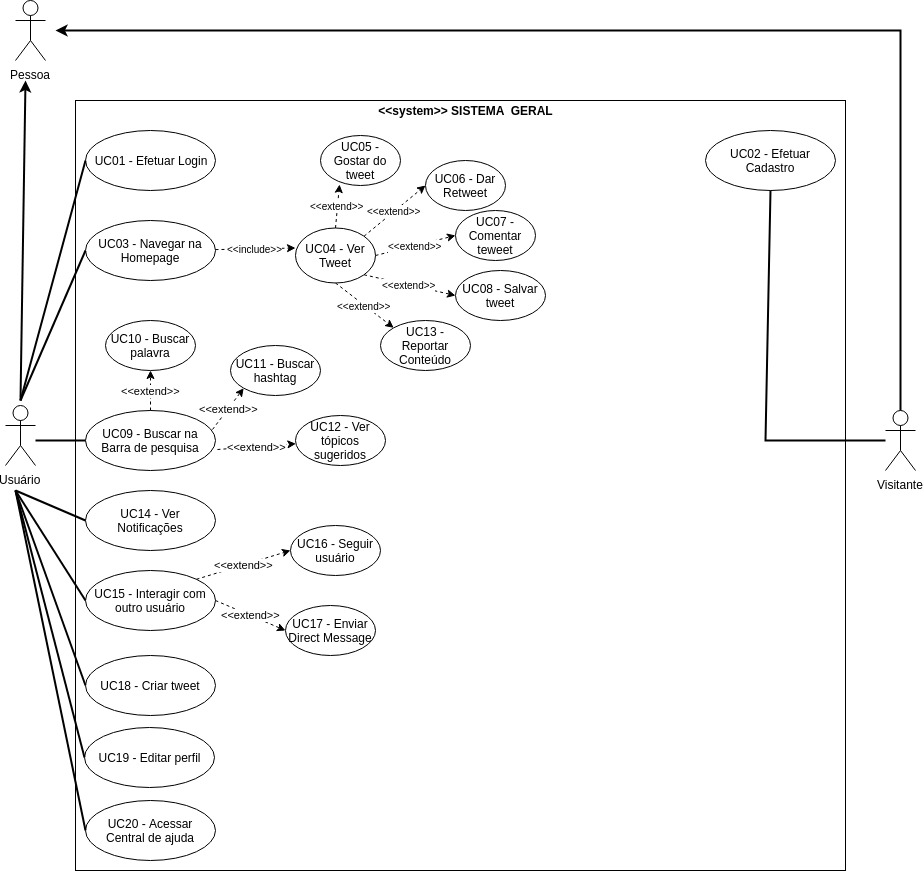

***
#Caso de Uso Geral

***
##Caso de uso: Sistema geral
**Autores:** Todos os integrantes.  
**Versão:** 0.1

***
#Especificações caso de uso Geral

## UC11 - Buscar Hashtags

|  |  |
|------|-------|
| **Descrição** | Funcionalidade responsável buscar uma hashtag na aplicação |
| **Ator(es)** | Usuário |
| **Pré-Condições** | * O usuário precisa ter acesso a internet   * O usuário precisa estar logado |
| **Pós-Condições** | * O usuário encontrará tweets que usaram aquela hashtag   * O usuário poderá ver se a hashtag está nos assuntos mais comentados do twitter |
| **Fluxo Principal** | [FP11] Este fluxo se inicia quando o usuário deseja buscar uma hashtag na aplicação   1. Usuário faz login na plataforma.   2. Usuário clica no botão de buscar.   3. Usuário digita a hashtag que ele deseja buscar.   4. Usuário vê tweets em destaque que utilizam aquela hashtag |
| **Fluxo(s) Alternativos** | [FA11] Possibilidade de ver tweets além dos destaques   O Usuário pode escolher ver os tweets mais recentes que usaram aquela hashtag, ver pessoas, fotos e vídeos que usaram a hashtag. |
| **Fluxo(s) de exceção** | [FE11]  Notificação de hashtag inexistente   Caso a hashtag buscada pelo usuário não exista, é retornada uma mensagem dizendo que nenhum resultado foi encontrado.|

## UC12 - Ver tópicos sugeridos

|  |  |
|------|-------|
| **Descrição** | Funcionalidade responsável por mostrar ao usuário tópicos que possam lhe interessar |
| **Ator(es)** | Usuário |
| **Pré-Condições** | * O usuário precisa ter acesso a internet   * O usuário precisa estar logado |
| **Pós-Condições** | * O usuário encontrará assuntos e tweets que possam lhe interessar   * O usuário poderá ver os assuntos mais comentados do twitter   * O usuário poderá ver notícias, esportes, diversão e entretenimento|
| **Fluxo Principal** | [FP12] Este fluxo se inicia quando o usuário deseja fazer alguma busca e vê os assuntos sugeridos   1. Usuário faz login na plataforma   2. Usuário clica no botão de buscar   3. Usuário se depara com as sugestões do twitter   4. Usuário vê tweets em destaque e pode escolher visualizar os tweets dos assuntos sugeridos |
| **Fluxo(s) Alternativos** | [FA12] Possibilidade de apenas realizar a busca   Possibilidade de apenas realizar a busca |
| **Fluxo(s) de exceção** | [FE12] Não identificados |

## UC13 - Reportar conteúdo

|  |  |
|------|-------|
| **Descrição** | Funcionalidade para denunciar conteúdos que sejam ofensivos ou que violam as diretrizes do twitter |
| **Ator(es)** | Usuário |
| **Pré-Condições** | * O usuário precisa ter acesso a internet   * O usuário precisa estar logado |
| **Pós-Condições** | * O usuário irá escolher o motivo da denúncia   * O usuário poderá bloquear ou silenciar o autor do tweet |
| **Fluxo Principal** | [FP13] Este fluxo se inicia quando o usuário se depara com algum conteúdo nocivo e deseja denunciá-lo   1. Usuário faz login na plataforma   2. Usuário visualiza o feed   3. Usuário vê tweet ofensivo   4. Usuário justifica o motivo da denúncia   5. Usuário finaliza a denúncia|
| **Fluxo(s) Alternativos** | [FA13] Usuário apenas denúncia o tweet   O Usuário pode escolher após a denúncia não silenciar ou bloquear o autor do tweet |
| **Fluxo(s) de exceção** | [FE12]  Denúncia inválida   Caso o Usuário faça a denúncia e o twitter decida que a publicação não fere as diretrizes do site, o usuário seŕa notificado se a publicação foi retirada ou não do ar por violar as diretrizes do twitter|

## UC14 - Ver notificações

|  |  |
|------|-------|
| **Descrição** | O usuário é notificado sempre que acontece alguma interação com outro usuário|
| **Ator(es)** | Usuário |
| **Pré-Condições** | * O usuário precisa ter acesso a internet   * O usuário precisa estar logado   * O usuário precisa seguir ou ser seguido por outros usuários|
| **Pós-Condições** | * O usuário verá a notificação |
| **Fluxo Principal** | [FP14]  Este fluxo se inicia quando o usuário é notificado de alguma atividade em seu twitter   1. Usuário é notificado   2. Usuário abre a notificação |
| **Fluxo(s) Alternativos** | [FA14] O Usuário pode escolher como interagir com a notificação   O Usuário pode escolher responder o tweet ou mensagem direta que gerou a notificação, ele pode curtir o tweet, pode retweetar ou pode apenas visualizar a notificação |
| **Fluxo(s) de exceção** | [FE14] Desativar notificações   Caso o Usuário se sinta incomodado pelas notificações ele pode desativá-las|

## UC15 - Interação com outros usuários

|  |  |
|------|-------|
| **Descrição** | O usuário pode reagir a publicações de outros usuários e também pode enviar mensagens diretas|
| **Ator(es)** | Usuário |
| **Pré-Condições** | * O usuário precisa ter acesso a internet   * O usuário precisa estar logado   * O usuário precisa seguir ou ser seguido por outros usuários|
| **Pós-Condições** | * O usuário poderá interagir com outros usuários|
| **Fluxo Principal** | [FP15]  Este fluxo se inicia quando o usuário interage com outros usuários   1. Usuário cria conta    2. Usuário sege outros usuários   3. Usuário interage com outros através de comentários, curtidas, retweets, comentários em publicações ou mensagens diretas|
| **Fluxo(s) Alternativos** | [FA15] O Usuário pode escolher apenas visualizar as publicações |
| **Fluxo(s) de exceção** | [FE15] Limitar interações   Caso o Usuário queira ele pode trancar o seu perfil para que apenas seus seguidores consigam visualizar suas publicações e interagir com elas, ele pode também trancar a caixa de mensagens|

## UC16 - Seguir outros usuários

|  |  |
|------|-------|
| **Descrição** | O usuário pode seguir outros usuários para poder visualizar seus tweets sempre que forem postados e poder interagir com o mesmo|
| **Ator(es)** | Usuário |
| **Pré-Condições** | * O usuário precisa ter acesso a internet   * O usuário precisa estar logado |
| **Pós-Condições** | * O usuário poderá interagir com outros usuários|
| **Fluxo Principal** | [FP16] Este fluxo se inicia quando o usuário quer seguir outra pessoa   1-Usuário faz login   2-Usuário visualiza o feed com tweets de outros usuários   3-Usuário clica no botão de pesquisar   4-Usuário busca pelo nome de outro usuário   5-Usuário começa a seguir este usuário.  clicando no botão “seguir” |
| **Fluxo(s) Alternativos** | [FA16] Seguir pessoas sugeridas   O usuário pode seguir as pessoas recomendadas pelo twitter. |
| **Fluxo(s) de exceção** | [FE16] Não usuário pode optar por não seguir ninguém|

## UC17 - Enviar mensagens diretas

|  |  |
|------|-------|
| **Descrição** | O usuário poderá ter conversas privadas com outros usuários que são seus seguidores ou tem a caixa de DM's aberta|
| **Ator(es)** | Usuário |
| **Pré-Condições** | * O usuário precisa ter acesso a internet   * O usuário precisa estar logado |
| **Pós-Condições** | * O usuário poderá ter conversas privadas com outros usuários|
| **Fluxo Principal** | [FP17] Este fluxo se inicia quando o usuário quer ter uma conversa através de uma espécie de chat   1-Usuário faz login   2- Usuário clica na caixa de mensagens   3- Usuário busca pelo nome de outro usuário   4-Usuário escreve mensagem   5-Usuário clica em enviar mensagem |
| **Fluxo(s) Alternativos** | [FA17]    O usuário pode habilitar a caixa de mensagem para receber mensagem de qualquer usuário do twitter |
| **Fluxo(s) de exceção** | [FE17] O usuário pode trancar a sua caixa de mensagens|

## UC18 - Criar tweets

|  |  |
|------|-------|
| **Descrição** | O usuário poderá postar frases, fotos, vídeos ou enquetes em seu perfil|
| **Ator(es)** | Usuário |
| **Pré-Condições** | * O usuário precisa ter acesso a internet   * O usuário precisa estar logado |
| **Pós-Condições** | * As postagens do usuário serão visiveis para os seus seguidores e para outras pessoas caso seu perfil seja aberto|
| **Fluxo Principal** | [FP18] Este fluxo se inicia quando o usuário deseja compartilhar algum momento ou informação em seu perfil   1-Usuário faz login   2- Usuário clica na caixa de publicações   3- Usuário escreve o que irá publicar    4-Usuário clica no botão "tweetar" |
| **Fluxo(s) Alternativos** | [FA18]    O usuário pode publicar em resposta a tweets de outras pessoas| 
| **Fluxo(s) de exceção** | [FE18] Não identificado|

## UC19 - Editar perfil

|  |  |
|------|-------|
| **Descrição** | O usuário poderá editar a aparência e as informações do seu perfil de acordo com suas preferências|
| **Ator(es)** | Usuário |
| **Pré-Condições** | * O usuário precisa ter acesso a internet   * O usuário precisa estar logado |
| **Pós-Condições** | * O perfil irá ter a aparência desejada pela usuário|
| **Fluxo Principal** | [FP19] Este fluxo se inicia quando o usuário deseja mudar a aparência, segurança ou informações em seu perfil   1-Usuário faz login   2- Usuário clica em "Perfil"   3- Usuário clica em "editar perfil"    4-Usuário escolhe qual das alterações disponiveis ele fará.   5- Usuário clica em "Salvar" e salva as alterações feitas.|
| **Fluxo(s) Alternativos** | [FA19]    O usuário pode escolher o que modificar   O usuário pode escolher editar sua foto de perfil, localização, data de nascimento, biográfia e nome.| 
| **Fluxo(s) de exceção** | [FE19] O usuário pode não fazer nenhuma alteração em seu perfil apenas clicando em "salvar"|

## UC20 - Acessar central de ajuda

|  |  |
|------|-------|
| **Descrição** | O usuário poderá procurar por ajudar e instruções de como o site funciona e deve ser utilizado|
| **Ator(es)** | Usuário |
| **Pré-Condições** | * O usuário precisa ter acesso a internet   * O usuário precisa estar logado |
| **Pós-Condições** | * O usuário irá sanar suas dúvidas a respeito do funcionamento do app/site|
| **Fluxo Principal** | [FP20] Este fluxo se inicia quando o usuário tem alguma dúvida a respeito do site   1-Usuário faz login   2- Usuário clica em "Central de Ajuda"   3- Usuário busca pela sua dúvida   4- Usuário é redirecionado para a página que sana suas dúvidas|
| **Fluxo(s) Alternativos** | [FA20]    O usuário pode escolher entre uma das opções de ajuda que o twitter disponibiliza   O usuário pode escolher entre algumas opções de ajuda que o twitter disponibiliza entre elas tem a opção de "Como usar o Twitter" entre outras| 
| **Fluxo(s) de exceção** | [FE20] O usuário faz busca inexistente  
Caso o usuário busque por uma dúvida que não está disponível na central de ajuda o twitter retorna uma mensagem de "Nenhum resultado encontrado" |

***

### Versionamento de edições desta página

| Data | Autor | Descrição | Versão |
|------|-------|-----------|--------|
| 24/09/2019 | Aline Laureano, Lorrany Azevedo | Criação da página e inserção do Caso de uso SISTEMA GERAL. | 0.1 |
|
| 27/09/2019 | Lorrany Azevedo |Especificação dos requisitos UC11 até o UC20 | 0.2 |

***
