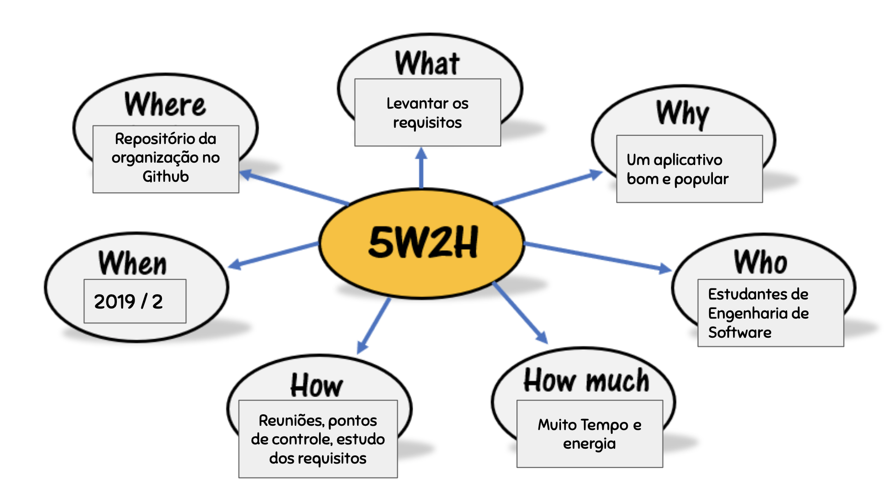

***
# Sobre o 5W2H

A ferramenta 5W2H nada mais é do que um checklist de atividades, prazos e responsabilidades que devem ser desenvolvidas com o máximo de clareza e eficiência por todos os envolvidos em um projeto ou até mesmo em processos dentro da empresa.

A sigla é formada pelas iniciais, em inglês, das sete diretrizes que, quando bem estabelecidas, eliminam quaisquer dúvidas que possam aparecer ao longo de um processo ou de uma atividade.

São elas:

#### Os 5W:

* What (o que será feito?)
* Why (por que será feito?)
* Where (onde será feito?)
* When (quando será feito?)
* Who (por quem será feito?)

#### Os 2H:

* How (como será feito?)
* How much(quanto vai custar?)

Ou seja, a metodologia 5W2H é formada pelas respostas para essas sete perguntas essenciais de qualquer planejamento, seja de um projeto ou de uma área inteira.

Fonte : [Treasy](https://www.treasy.com.br/blog/5w2h/)

***
# Para o Twitter :

***
## Versionamento de edições desta página
| Data | Autor | Descrição | Versão |
|------|-------|-----------|--------|
| 13/09/2019 | Erick Giffoni | Criação e edição inicial da página. | 0.1 |
