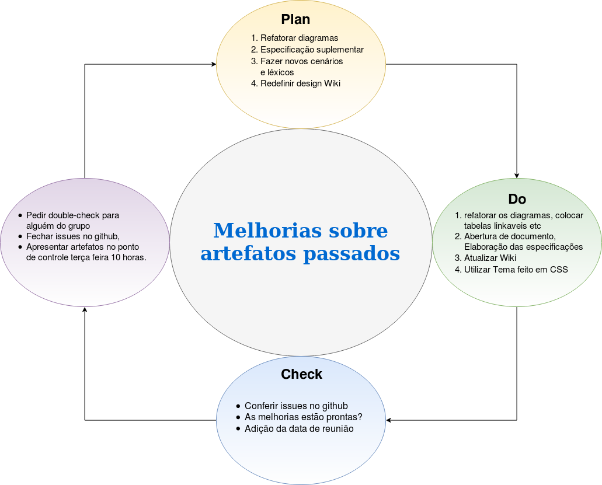

***

# Sobe o PDCA

O conceito de PDCA baseia-se no método científico, desenvolvido a partir do trabalho de Francis Bacon (Novum Organum, 1620). O método científico pode ser escrito como "hipótese" - "experimento" - "avaliação" ou o Planejar, Executar e Verificar. Shewhart descreveu fabricação sob "controle", sob controle estatístico, como um processo de três etapas de especificação, produção e inspeção. 

# Etapas
- Planejar
- Desenvolver
- Estudar
- Verificar

***

## Planejar / Pensar / Projetar

Estabelecer os objetivos e processos necessários para entregar resultados de acordo com o projetado (objetivos ou metas). Ao estabelecer expectativas de resultado, a integridade e precisão da especificação também é uma parte da melhoria almejada. Quando possível, começar em pequena escala para testar os possíveis efeitos.

Consiste no estabelecimento de objetivos e de processos fundamentais para garantir os resultados, conforme o que se espera atingir em termos de metas para a organização. Para Vieira Filho “definidas as metas, deve-se definir os métodos para atingi-las. Nesta etapa, também são definidos os procedimentos que serão seguidos para a obtenção das metas.”

## Desenvolver / Executar / Dirigir

Implementar o plano, executar o processo, fazer o produto. Coletar dados para mapeamento e análise dos próximos passos "Checar" e "Ajustar". Portanto esta etapa gera muito cuidado pois pode não ser a causa raiz.

Definida como a etapa executiva da metodologia PDCA, deve-se executar todos e cada um dos processos. Antes de iniciar a fase de execução é necessário educar e treinar todos os envolvidos no processo para garantir que todos estejam comprometidos e tudo saia conforme o planejamento realizado na etapa anterior. “Todos os envolvidos são treinados em procedimentos que tem como base as metas estabelecidas, realizam as atividades e colhem dados.”

## Estudar / Checar         / Verificar

Estudar o resultado (medido e coletado no passo anterior “Desenvolver”) e compará-lo em relação aos resultados esperados (objetivos estabelecidos no passo “PLANEJAR”) para determinar quaisquer diferenças. Procurar por desvios principalmente na aplicação do plano e também olhar para a adequação e abrangência do plano permite a execução do próximo passo, ou seja, "AGIR". Traçar dados pode fazer isso muito mais fácil para ver as tendências ao longo de vários ciclos de PDCA e assim converter os dados coletados em informação. Informação é o que você precisa para a próxima etapa "Ajustar".

Após planejar e pôr em prática, o gestor precisa monitorar e avaliar constantemente os resultados obtidos com a execução das atividades. Avaliar processos e resultados, confrontando-os com o planejado, com os objetivos, especificações e estado desejado, consolidando as informações, eventualmente confeccionando relatórios específicos.

Vieira Filho afirma que “esta é uma etapa puramente gerencial, que verifica se o que foi executado está de acordo com as metas estabelecidas. Na etapa anterior, são coletados dados das ações e estes dados são analisados nesta etapa e comparados com o planejado.”

## Alavancar/Atuar/Agir

Tomar ações corretivas sobre as diferenças significativas entre os resultados reais e planejados. Analisar as diferenças para determinar suas causas. Determinar onde aplicar as mudanças que incluem a melhoria do processo ou produto. Quando uma passagem por estes quatro passos não resultar na necessidade de alguma melhora, o método ao qual o PDCA é aplicado pode ser refinado com maiores detalhe na iteração seguinte do ciclo, ou a atenção deve ser colocada de uma forma diferente em alguma fase do processo. O plano PDCA quando aplicado junto ao Sistema de Gestão da Qualidade pode implementar ações para atingir a melhoria contínua, assegurar a operação e controle dos processos produtivos.

Nesta etapa é preciso tomar as providências estipuladas nas avaliações e relatórios sobre os processos. Se necessário, o gestor deve traçar novos planos para a melhoria do procedimento, visando sempre a correção máxima de falhas e o aprimoramento dos processos da empresa.

“A atuação é corretiva, ou seja, caso a operação realizada não esteja de acordo com o planejado, deve-se atuar corretivamente com planos de ação para a correção de rumo visando atingir a meta estabelecida.” 

***

# Para o Twitter :

***
## Versionamento de edições desta página
| Data | Autor | Descrição | Versão |
|------|-------|-----------|--------|
| 18/10/2019 | Fernando Aguilar | Criação e edição inicial da página. | 0.1 |
