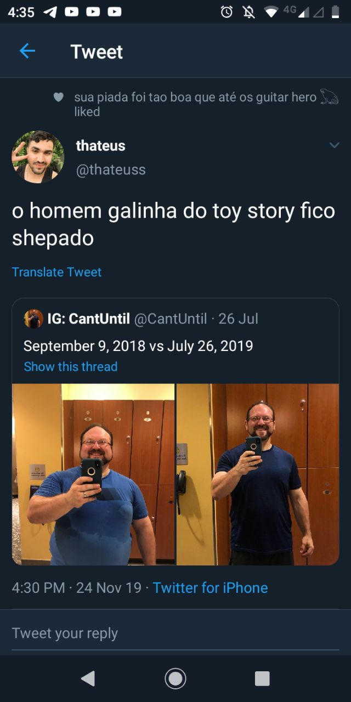
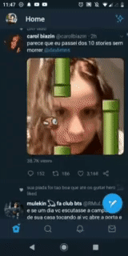
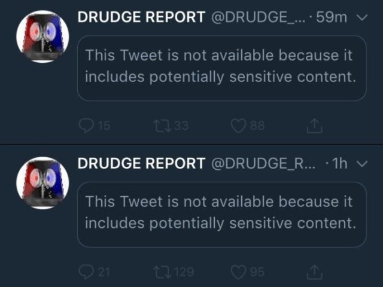

---

# Telas

As telas são gifs das atividades do aplicativo Twitter referentes ao resquisitos levantados pela equipe na etapa de elicitação.

## **<a href="#telaR001">Tela R001</a>**

## **<a href="#telaR004">Tela R004</a>**

## **<a href="#telaR006">Tela R006</a>**

## **<a href="#telaR006">Tela R007</a>**

## **<a href="#telaR008">Tela R008</a>**

## **<a href="#telaR010">Tela R010</a>**

## **<a href="#telaR011">Tela R011</a>**

## **<a href="#telaR012">Tela R012</a>**

## **<a href="#telaR017">Tela R017</a>**

## **<a href="#telaR018">Tela R018</a>**

## **<a href="#telaR020">Tela R020</a>**

## **<a href="#telaR026">Tela R026</a>**

## **<a href="#telaR026">Tela R029</a>**

---

## Versionamento de edições desta página

| Data       | Autor            | Descrição                | Versão |
| ---------- | ---------------- | ------------------------ | ------ |
| 21/11/2019 | Lorrany | Criação da página  | 0.1    |
| 21/11/2019 | Lorrany Azevedo | Adição de telas | 0.4 |
|21/11/2019|Bruno Duarte|Adicionando telas|0.5|
|25/11/2019|Eugênio Sales|Adicionando telas da R020|0.5|
