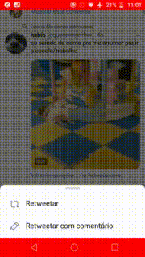
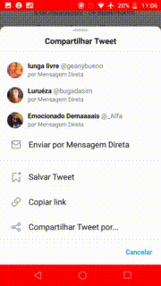
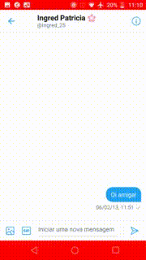

---

# Telas

As telas são gifs das atividades do aplicativo Twitter referentes ao resquisitos levantados pela equipe na etapa de elicitação.

## **<a href="#telaR001">Tela R001</a>**

## **<a href="#telaR004">Tela R004</a>**

## **<a href="#telaR006">Tela R006</a>**

---

## Versionamento de edições desta página

| Data       | Autor            | Descrição                | Versão |
| ---------- | ---------------- | ------------------------ | ------ |
| 21/11/2019 | Lorrany | Criação da página  | 0.1    |
| 21/11/2019 | Lorrany Azevedo | Adição de telas | 0.4 |
