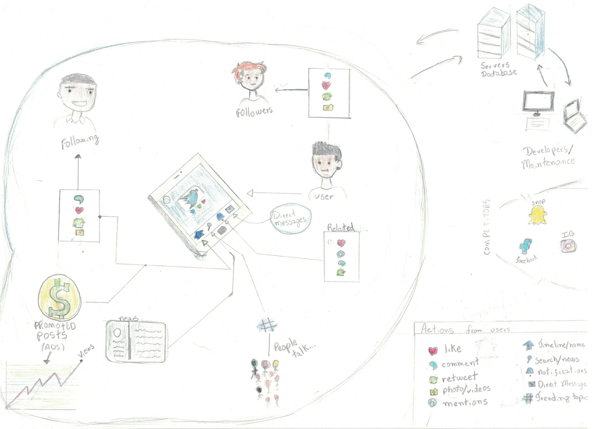
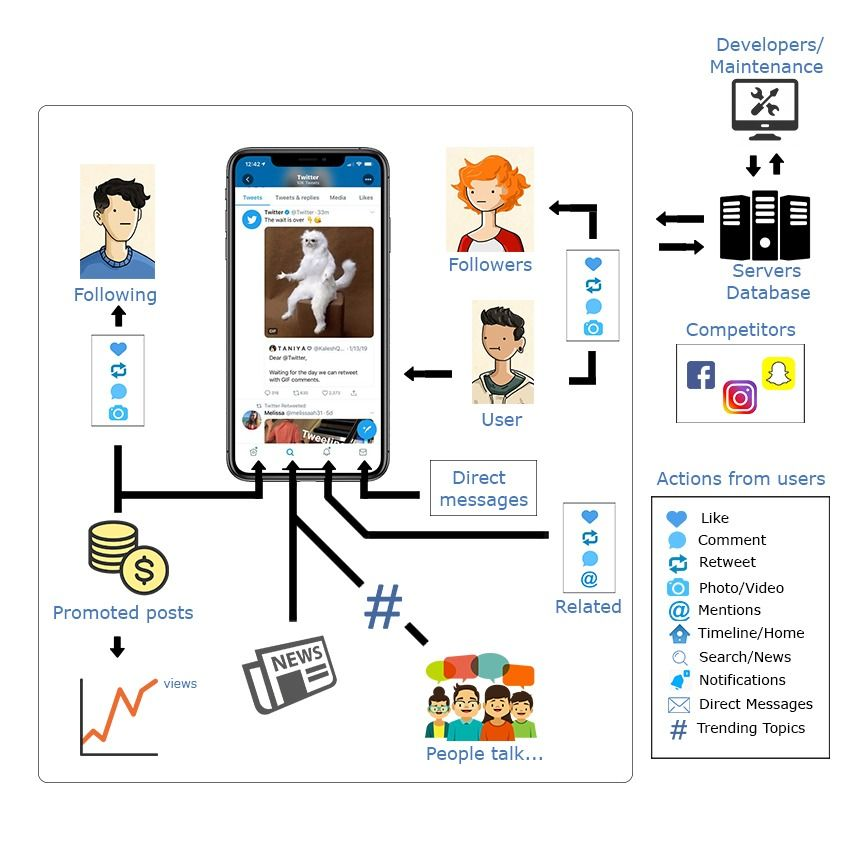
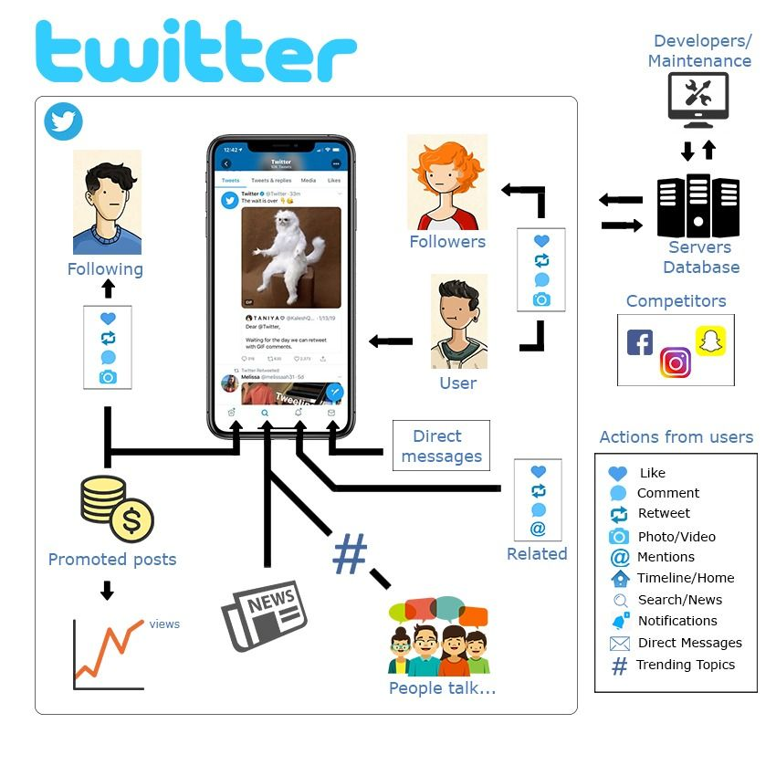

***
# RichPicture
O RichPicture é uma técnica que serve para a obtenção do entendimento de algum sistema. Ele é desenvolvido, inicialmente, à mão-livre, podendo ser criado em conjunto com o(s) cliente(s).

***

## Artefatos desenvolvidos

### [RichPicture01] - Visão Geral do Twitter

*Versão:* 0.1  
Autor(es): *Todos os integrantes do grupo.*

### [RichPicture02] - Visão Geral do Twitter
Versão digital do Rich Picture anterior 
*Versão:* 0.2  
*Autor(es):*Todos os integrantes*

### [RichPicture03] - Visão Geral do Twitter
Esta versão foi realizada após a análise dos artefatos com base nos checklists de critérios 

*Versão:* 0.3  
Autor(es):*Todos os integrantes do grupo.*

### [RichPicture04] - Visão Geral do Twitter
Versão Final do Rich Picture 

*Versão:* 0.4  
Autor(es):*Todos os integrantes do grupo*

## Referências
* [Ebrary] Young. Ralph. Requirements Engineering Handbook. Norwood, US: Artech House Books, 2023.
* [Open Acess] Leite, Julio Cesar Sampaio do Prado. Livro Vivo - Engenharia de Requisitos.
* [Ebrary] Chemuturi, Murali. Matering Software Quality Assurance : Best Pratices, Tools and Technique for Software Developers. Ft. Lauderale, US: J. Ross Publishing Inc., 2010.
***

## Versionamento de edições desta página
| Data | Autor | Descrição | Versão |
|------|-------|-----------|--------|
| 28/08/2019 | Aline Laureano | Criação da página. | 0.1 |
| 02/09/2019 | Fernando Aguilar | Upload do Richpicture. | 0.2 |
| 03/09/2019 | Aline Laureano | Adição da logo do Twitter, da descrição da página e da descrição do RichPicture. | 0.3|
|23/11/2019|Bruno Duarte|Adicionando Rich Picture Digital|0.4|
|23/11/2019|Bruno Duarte|Refatorando Rich Picture Digital|0.5|
|23/11/2019|Bruno Duarte|Adicionando versão final do Rich Picture|0.6|